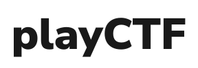

<p align="center">
  
</p>

## Overview

- playCTF is the frontend service powered by Beast. 
- It is written in VueJS and integrates all the endpoints provided by Beast which makes deploying challenges a breeze.
- There are different panels for admins and users which enable easy moderation of CTF competitions.

Visit [playctf.sdslabs.co/docs](https://playctf.sdslabs.co/docs) for the more details and documentation about the APIs.

Also check out the Beast source code at https://github.com/sdslabs/beast.

## Project setup and run
- Install `docker` and `docker-compose`
- Run `docker-compose up --build -d` to spin up the playctf container
- Site can be accessed on `localhost:8080` 

### Compiles and minifies for production
```
npm run build
```

### Lints and fixes files
```
npm run lint
```
